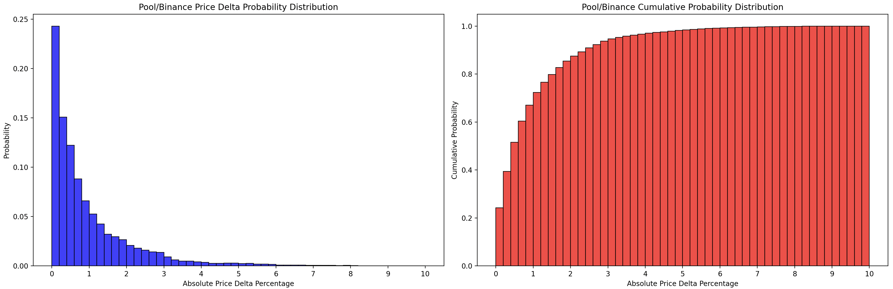
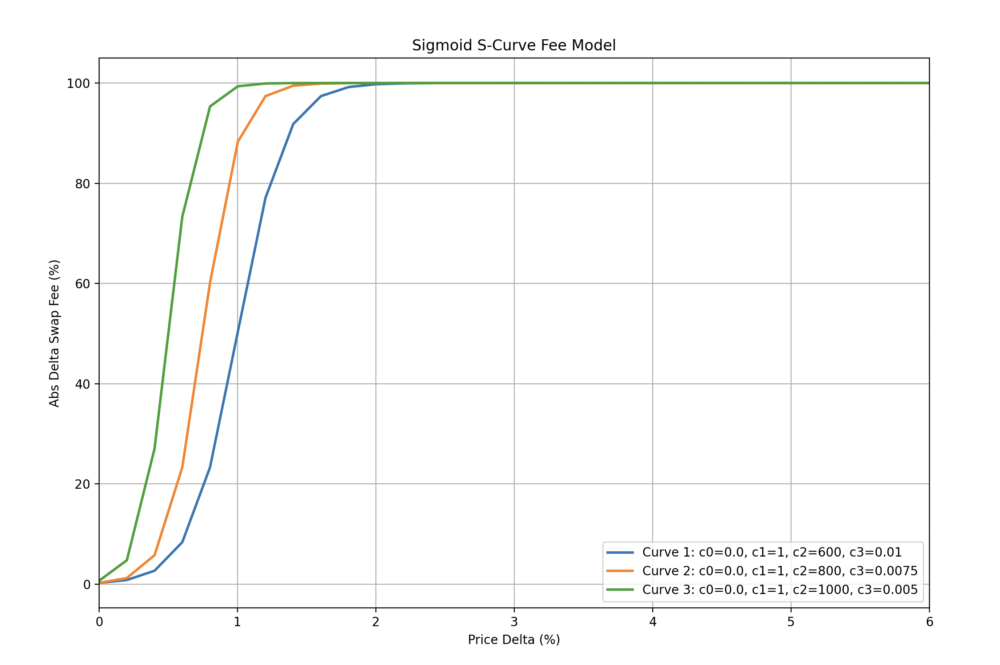

# Sigmoid Directional Fees Simulations

These simulations were performed in the context of the **Uniswap Hook Incubator** by **Atrium Academy**.

For my capstone project, I've developed a dynamic fee mechanism called **"Sigmoid Directional Fees,"** inspired by [Nezlobin Fees](https://x.com/0x94305/status/1674857993740111872).

Unlike Nezlobin Fees, which calculate fees based on the price difference between consecutive blocks, my approach uses an external oracle price to adjust fees at the top of each block.

## Dynamic Fee Curve: The Sigmoid S-Curve Model

For the dynamic fee curve, I've opted for a **Sigmoid s-curve model**. This model features:

- A **slow fee increase** for small discrepancies between the pool price and the oracle price.
- **Rapid exponential growth** as the discrepancy widens.
- A **cap at a maximum fee** for significant price differences.

### Sigmoid Curve Mathematical Expression:

$$
\text{fee}(\Delta p) = c_0 + \frac{c_1}{1 + e^{c_2 \cdot (c_3 - \Delta p)}}
$$

Where $\Delta p$ represents the discrepancy between the pool price after a certain trade and the Binance price at the corresponding estimated timestamp.

### Curve Design Objectives

This curve design aims to:

- **Minimize impermanent loss (IL)** from arbitrageurs by keeping the fee delta negligible for small price discrepancies (since arbitrage is unlikely due to associated costs exceeding the profit).
- **Penalize users** swapping in the direction of arbitrage for larger discrepancies, without exceeding a **2x fee cap**.
- **Avoid deterring informed traders**, who would avoid pools with excessively high fees, thereby inadvertently penalizing uninformed traders who would be the only ones swapping in such adverse conditions.

### Implementation Notes

As this curve was implemented as a smart contract and exponential calculations are gas-expensive, the fee value is only updated in the first swap of each block and remains the same for subsequent swaps within the same block. This implementation decision has a low impact on reducing arbitrage since effective arbitrage only happens at the top of the block due to high MEV searcher competition.

### Data Sample

The data sample for this analysis consists of:

- **Swap Event Logs** from the USDC/WETH-0.05% Uniswap V3 pool (contract address: [0x88e6A0c2dDD26FEEb64F039a2c41296FcB3f5640](https://etherscan.io/address/0x88e6A0c2dDD26FEEb64F039a2c41296FcB3f5640)).
- **Blocks ranging from 20,020,000 to 20,675,000**, covering approximately 3 months of data from July 4th to September 4th, 2024. This range includes around 583k swap events.

### Generated Charts

As shown in the cumulative probability chart above, approximately 85% of the price discrepancies between the pool and Binance are below 2%, and around 70% are below 1%. This information was crucial for fine-tuning the sigmoid curve used in this model, as the main fee variations should occur below the 2% threshold for this fee model to have a noticeable impact.

Based on this analysis, the following three sigmoid curves were tested:

Finally, Curve 1 was selected

## Results

### Shell Output:

#### Original Flat Fee Analysis Summary:

- **Total Swap Fee (USD):** 10,621,859.89
- **Mean IL Percentage:** 0.828985
- **Median IL Percentage:** 0.396647
- **Median Swap Fee (USD):** 1.250903
- **Mean Swap Fee (USD):** 18.225722
- **Std Dev Swap Fee (USD):** 69.177775
- **Min Swap Fee (USD):** 0.000000
- **Max Swap Fee (USD):** 7,327.261163
- **Total Arb Profit:** 73,006,053.50

#### Sigmoid Fee Analysis Summary:

- **Total Swap Fee (USD):** 10,620,848.51
- **Median Swap Fee (USD):** 0.003221
- **Mean Swap Fee (USD):** 18.223987
- **Std Dev Swap Fee (USD):** 98.053199
- **Min Swap Fee (USD):** 0.000000
- **Max Swap Fee (USD):** 12,092.687355
- **Total Arb Profit:** 68,495,890.62
- **Total Avoided Arb Trades:** 2,152

#### Price Delta Analysis Summary:

- **Mean Price Delta Percentage:** 1.077736
- **Median Price Delta Percentage:** 0.575362
- **Std Dev Price Delta Percentage:** 1.611350
- **Min Price Delta Percentage:** 0.000000
- **Max Price Delta Percentage:** 24.0347

### Note on Code Quality

The code in this repository was developed in the context of a hackathon and, as such, is quite messy. Its only goal was to function correctly for the hackathon. The code must be thoroughly refactored before being used in any other context.

### Hook Implementation

The solidity implemantation of this Uniswap V4 hook can be found in this repository:
https://github.com/adsvferreira/sigmoid-fees-hook
